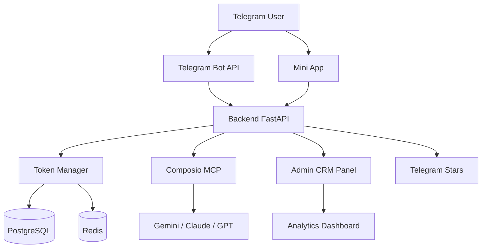

# Telegram AI Agent

**AI Agent Bot with Token System & Admin CRM** — конкурентный продукт на базе референса [Mira](https://t.me/mira) и [ChatOn](https://chaton.ai/) с собственной токеновой экономикой, ценами **на 50% дешевле аналогов** и профессиональной CRM-системой для администрирования.

---

## 🚀 Что внутри

- **Telegram Bot** — генерация изображений, видео, текста, голоса, поиск, анализ документов.
- **Telegram Mini App** — встроенный UI для управления балансом и подпиской.
- **Токеновая экономика** — единая валюта (tokens) для всех сервисов.
- **Покупка за Telegram Stars** — мгновенная монетизация.
- **Admin CRM Panel** — управление пользователями, ценами, аналитикой и рассылками.
- **Composio MCP** — единая интеграция с Gemini / Claude / GPT.

## 🏗️ Архитектура



Подробнее — [`docs/ARCHITECTURE.md`](docs/ARCHITECTURE.md).

## 💰 Pricing (vs Mira)

| Пакет | Tokens | Stars | Mira | Отрыв |
|-------|--------|-------|------|-------|
| Starter | 500 | 250 ⭐ | 500 ⭐ | -50% |
| Basic | 1,200 | 500 ⭐ | 1,000 ⭐ | -50% |
| Premium | 2,000 | 750 ⭐ | 1,500 ⭐ | -50% |
| Pro (мес.) | 2,000 / мес | 500 ⭐ | 999 ⭐ | -50% |

См. [`docs/PRICING_STRATEGY.md`](docs/PRICING_STRATEGY.md) и [`docs/TOKEN_ECONOMY.md`](docs/TOKEN_ECONOMY.md).

## 🗂️ Структура репозитория

```
.
├── backend/              # FastAPI приложение
├── mini-app/             # Telegram Mini App (React)
├── admin-dashboard/      # Admin CRM (Next.js)
├── docker/               # Dockerfile и compose
├── docs/                 # Документация
│   ├── ARCHITECTURE.md
│   ├── ROADMAP.md
│   ├── TOKEN_ECONOMY.md
│   ├── PRICING_STRATEGY.md
│   ├── DATABASE_SCHEMA.md
│   ├── API_REFERENCE.md
│   ├── ADMIN_CRM_GUIDE.md
│   ├── SECURITY.md
│   └── DEPLOYMENT.md
├── scripts/              # Утилиты
└── .github/              # CI / шаблоны issues и PR
```

## 🗺️ Roadmap

| Phase | Период | Фокус |
|-------|--------|-------|
| [Phase 1](https://github.com/labtgbot/telegram-ai-agent/milestone/1) | Weeks 1-3 | MVP Core: бот, токены, базовая интеграция |
| [Phase 2](https://github.com/labtgbot/telegram-ai-agent/milestone/2) | Weeks 4-6 | Все AI-сервисы, оплата, Mini App |
| [Phase 3](https://github.com/labtgbot/telegram-ai-agent/milestone/3) | Weeks 7-8 | Admin CRM, аналитика, тесты |
| [Phase 4](https://github.com/labtgbot/telegram-ai-agent/milestone/4) | Weeks 9-10 | Production, мониторинг, релиз |

Полная декомпозиция — [`docs/ROADMAP.md`](docs/ROADMAP.md) и [Issues](https://github.com/labtgbot/telegram-ai-agent/issues).

## 🛠️ Tech Stack

| Слой | Технологии |
|------|-----------|
| Backend | FastAPI · Python 3.11+ · SQLAlchemy · Alembic |
| DB / Cache | PostgreSQL 15 · Redis 7 |
| Async tasks | Celery |
| Frontend | React · TypeScript · Telegram WebApp SDK |
| Admin | Next.js 14 · TypeScript |
| AI | Composio MCP · Gemini · Claude · GPT |
| Payments | Telegram Stars |
| Infra | Docker · Kubernetes · GitHub Actions |
| Monitoring | Prometheus · Grafana · Sentry |

## 🤝 Contributing

Workflow, code style, commit conventions — в [`CONTRIBUTING.md`](CONTRIBUTING.md).

## 📜 Ссылки

- Telegram Bot API: <https://core.telegram.org/bots/api>
- Mini Apps: <https://core.telegram.org/bots/webapps>
- Telegram Stars: <https://core.telegram.org/bots/payments#telegram-stars>
- Composio MCP: <https://docs.composio.dev/mcp>

## 📄 License

Copyright (c) 2026 Антон Порошин. Все права защищены.
