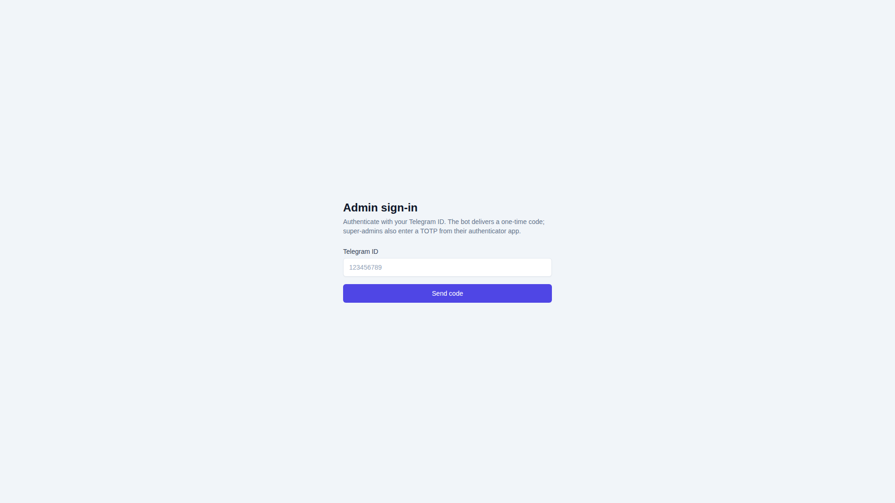
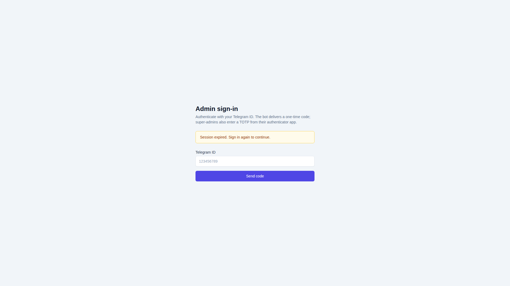

# Admin Guide

Operations handbook for the **Telegram AI Agent CRM** (`admin-dashboard/`,
Next.js 14). Targets: support engineers, ops, release managers, finance.

For developer-level architecture see
[`docs/ARCHITECTURE.md`](ARCHITECTURE.md); for end-user behaviour see
[`docs/USER_GUIDE.md`](USER_GUIDE.md); the original short-form notes live
in [`docs/ADMIN_CRM_GUIDE.md`](ADMIN_CRM_GUIDE.md).

---

## 1. Access & roles

The CRM authenticates against `POST /api/v1/auth/admin/login` (JWT + TOTP).
First-time setup:

1. Backend operator runs `python -m scripts.seed_admin --email you@…
   --role super_admin` — provisions the admin row and prints a TOTP
   provisioning URI.
2. Add the URI to your authenticator (1Password / Authy / Aegis).
3. Open the CRM URL (`https://admin.example.com/`) → enter email,
   password and TOTP. Successful login sets an HttpOnly cookie scoped
   to `/`.

If your token expires the page renders an explicit re-login banner:

### Roles

| Role            | Allowed sections                                          |
|-----------------|-----------------------------------------------------------|
| `super_admin`   | All sections, including Pricing and System settings       |
| `support_admin` | Users, Transactions, Broadcasts, Content (no Pricing)     |
| `analyst`       | Dashboard + Analytics, read-only                          |

Role gates are enforced server-side on every `/api/v1/admin/*` endpoint
(`backend/app/auth/permissions.py`). The UI hides links the current role
cannot use, but the API is the source of truth.

### Audit log

Every state-changing action writes to `admin_audit_logs`:

| Column     | Meaning                                         |
|------------|-------------------------------------------------|
| `action`   | e.g. `user.add_tokens`, `pricing.update`        |
| `actor_id` | Admin who triggered the action                  |
| `target`   | `{table, id}` for the affected row              |
| `before` / `after` | JSON diff of changed fields             |
| `ip`, `user_agent` | Request metadata                        |
| `created_at`       | UTC timestamp                           |

Rows are append-only. Reading is exposed via `GET
/admin/system/audit-log` (and a UI list under **Settings → Audit log**).

---

## 2. Modules

### 2.1 Dashboard

Landing page. Aggregates ship from `GET /admin/dashboard?period=7d|30d`.

- KPI cards: total / new / active users, revenue today + MRR, tokens
  sold, conversion rate, refund rate, daily-bonus claims.
- Charts: revenue last 30 days, daily-active-users last 7 days, token
  spend by service.
- Two side panels: latest 10 transactions and latest 10 new users with
  one-click drill-down.

### 2.2 Users

`/users` — search, filters, bulk export, drill-down drawer.

- **Search** by Telegram ID, username, or referral code; filters for
  premium status, banned, language, country, signup window.
- **Drawer** shows balance, lifetime spend (tokens + Stars), referrals,
  active subscriptions, last 50 transactions and a per-service usage
  histogram.
- **Actions:**
  - **Add tokens** (`POST /admin/users/{id}/add-tokens`) — requires
    reason; appears in audit log + user-facing history.
  - **Grant premium** (`/grant-premium`) — sets `users.is_premium`
    until N days from today.
  - **Ban / unban** (`/ban`, `/unban`) — with reason and optional
    `duration_days`. Banned users get `403 user_banned` on every call.
  - **Send message** — composes a one-off broadcast targeted at the
    single user (uses the same delivery worker).
- **CSV export** of the current filter (paginated, server-side).

### 2.3 Transactions

`/transactions` — full transaction ledger.

- Filters: status (`pending` / `completed` / `failed` / `refunded`),
  payment type (`stars` / `bonus` / `referral` / `admin_grant`),
  date range, package code.
- Row drill-down: full payload, raw Telegram webhook (if applicable),
  `payment_id` chain, related audit-log entries.
- **Retry webhook** (`POST /admin/transactions/{id}/retry-webhook`) —
  replays a stuck Stars payment through the existing dispatcher.
  Idempotent by `telegram_payment_charge_id`.
- **Refund** (`/refund`) — issues a Telegram-side refund and a
  compensating transaction; both rows surface in the user's history.

### 2.4 Pricing

`/pricing` — live pricing matrix (super_admin only). Backed by
`GET /admin/pricing` and `POST /admin/pricing/update`.

- Edit `stars_amount`, `tokens_amount`, `is_active` per package code.
- Global discount slider (applies to all packages) and seasonal-promo
  table (`code`, `expires_at`, `percent`).
- **Changes apply immediately** — Mini App reads pricing on every
  invoice creation and the in-process TTL cache invalidates on update
  (`docs/PERFORMANCE.md > Pricing cache`).
- The history pane (`/admin/pricing/history`) shows every change with
  the responsible admin.

### 2.5 Analytics

`/analytics` — operator-grade reports. Each tab maps to a server
endpoint:

| Tab                | Source                                              |
|--------------------|-----------------------------------------------------|
| Revenue            | `GET /admin/analytics/revenue`                      |
| Funnel             | `GET /admin/analytics/funnel`                       |
| Retention          | `GET /admin/analytics/retention?day=1\|7\|30`        |
| LTV                | `GET /admin/analytics/ltv`                          |
| Token mix          | `GET /admin/analytics/user-behavior?metric=spend`   |

Aggregates are computed nightly by `app/workers/analytics_snapshot.py`
and cached for fast UI loads. CSV export is available from each chart's
overflow menu.

### 2.6 Broadcast

`/broadcast` — outbound messaging composer.

1. Pick **audience**: `all`, `premium`, `free`, or a saved segment
   (`/admin/segments`).
2. Write the message (plain text, Markdown V2, or attach media).
3. Choose **send mode**: immediate or scheduled (UTC datetime).
4. Preview audience count + estimated delivery time. The worker
   throttles to Telegram's per-bot rate limit (30 msg/s by default).

Drafts auto-save every 5 seconds. Once sent, the campaign appears on
the **History** tab with delivery / read counts.

### 2.7 Content

`/content` — editable copy: bot welcome, FAQ entries, prompt templates
(image / video / search), broadcast templates.

- Each entry has a markdown editor + live preview.
- **Locale-aware** (`ru` / `en`). The bot picks the locale at runtime
  based on the user's Telegram language code with `en` fallback.
- Versioned: every save creates a new row in
  `content_revisions`; rollback is one click.

### 2.8 Settings

`/settings` — system controls (super_admin).

- **Maintenance mode** — flips a Redis flag; both the bot and the Mini
  App show a "maintenance" banner and the API returns `503` for
  non-admin requests.
- **Rate limits** — per-tariff RPS and per-day budgets
  (`admin_settings.rate_limits.*`).
- **Composio config** — toggle Gemini / Claude / GPT tool-routes,
  short-circuit a broken provider.
- **Admins** — list, invite, deactivate, reset TOTP for other admins.
- **Daily bonus** — see §3 below.

### 2.9 System (build / health)

`/system` — diagnostic view (read-only for support_admin).

- Backend `/health` payload, image tags, last deploy time.
- Redis / Postgres connection status, slow-query top 10.
- Latest Sentry issues by frequency.

---

## 3. Daily-bonus controls

Daily bonus rules are stored in `admin_settings` and read on **every**
claim — no redeploy needed.

| `setting_key`               | Type / shape                                                    | Effect                                                       |
|-----------------------------|------------------------------------------------------------------|--------------------------------------------------------------|
| `daily_bonus.enabled`       | `bool` or `{"enabled": true}`                                   | Master switch. `false` → `403 daily_bonus_disabled`.        |
| `daily_bonus.amounts`       | `list[int]` / `{"amounts": [...]}` / CSV (`"10,12,15,20"`)      | Streak ladder. Last item is the cap. Invalid → env default. |

Operational notes:

- Invalid overrides are logged as `daily_bonus.bad_amounts_override`
  and the service continues with the env default.
- Toggling the switch does **not** retroactively void prior claims.
- To pause the bonus for a single user, use Users → Ban (or a
  per-user `users.daily_bonus_blocked` flag if you've migrated to it).

See [`docs/TOKEN_ECONOMY.md > Daily Bonus & Streak`](TOKEN_ECONOMY.md).

---

## 4. Runbooks

### 4.1 Refund a Telegram Stars payment

1. **Users** → find the user → **Transactions** tab → locate the row.
2. Click **Refund** → enter reason → confirm.
3. CRM calls `POST /admin/transactions/{id}/refund`, which:
   - issues Telegram `refundStarPayment`;
   - inserts a compensating row (`type=refund`, negative tokens);
   - flips the original `transactions.status` to `refunded`.
4. Verify the user's balance in the drawer; the user gets a system
   message from the bot.

### 4.2 Comp tokens (support credit)

1. **Users** → drawer → **Add tokens**.
2. Amount + reason (visible in audit log + user history).
3. Bot pushes a system message: *"Support credited you N tokens."*

### 4.3 Replay a stuck Stars webhook

1. **Transactions** → status filter `pending`, sort by `created_at`.
2. Open the row → confirm Telegram debit happened (`telegram_payment_
   charge_id` present).
3. Click **Retry webhook** — the dispatcher idempotently re-finalises
   the payment.
4. If `telegram_payment_charge_id` is empty after 30 minutes, the
   payment never succeeded; advise the user to re-purchase.

### 4.4 Promote / demote an admin

1. **Settings → Admins** → invite by email + role.
2. The invitee receives a one-time setup link (TOTP enrolment).
3. To demote, change role inline; to revoke, click **Deactivate**.
4. Audit log captures both events.

### 4.5 Maintenance mode

- Flip the toggle under **Settings → Maintenance**.
- Bot and Mini App switch to a friendly banner within ~5 s
  (Redis pub/sub).
- Admin CRM **stays available** — it bypasses the gate.
- Don't forget to flip it back; alert routes are documented in
  `docs/POST_LAUNCH.md > Maintenance windows`.

### 4.6 Investigate a user complaint

1. Reproduce by opening the user's drawer in **Users**.
2. Check **Transactions** for the relevant timestamp; **Audit log**
   for any admin actions on the user.
3. **System → Sentry** to correlate with backend issues.
4. Add a note to the user (drawer → Notes) — visible to other admins.

### 4.7 Pricing change

1. Confirm change is sized via `docs/PRICING_STRATEGY.md`.
2. **Pricing** → edit row → **Save**.
3. Validate via the Mini App on a test account that the new price is
   visible on the next invoice creation.
4. Audit log shows the diff and responsible admin.

### 4.8 Bulk message

1. **Broadcast** → audience + message → **Preview**.
2. Inspect the audience count, ETA and the test render.
3. Send / schedule.
4. **History** tab shows delivery and click-throughs (if links are
   instrumented).

---

## 5. Screenshots index

The repo ships baseline screenshots under
[`docs/screenshots/`](screenshots/). Update them whenever the UI
materially changes (release-time checklist:
`docs/LAUNCH_CHECKLIST.md`):

| File                              | Page                                  |
|-----------------------------------|---------------------------------------|
| `admin-login.png`                 | `/login` (admin)                      |
| `admin-login-expired.png`         | `/login` after JWT expiry             |
| `mini-app-home.png`               | Mini App home (user-side reference)   |
| `mini-app-balance.png`            | Mini App balance card                 |
| `mini-app-settings.png`           | Mini App settings drawer              |

> 📸 Adding new screenshots? PNG, 1280×800 max, redact PII. Reference
> them with relative paths (`screenshots/your-shot.png`) so the GitHub
> blob render works in private repos too.

---

## 6. Troubleshooting

| Symptom                                                | First check                                                                                          |
|--------------------------------------------------------|------------------------------------------------------------------------------------------------------|
| CRM loads but every list is empty                      | `Network` tab: are `/api/v1/admin/*` calls 401? JWT cookie expired — re-login.                       |
| Login loops back to `/login`                           | Browser blocking 3rd-party cookies in incognito, or `Admin-Domain` mismatch in chart values.         |
| "Telegram API error" on Refund                         | Telegram refunds are time-limited (90 days). Bot token revoked? See `docs/DEPLOYMENT.md > Secrets`.  |
| Pricing edits don't propagate                          | Redis down → cache won't invalidate. `redis-cli ping` from a backend pod.                            |
| Broadcast stuck at "queued"                            | Worker dyno died; restart `telegram-ai-agent-worker` deployment.                                     |
| Sentry shows `redis_set` errors                        | Likely Redis OOM / eviction; check `Monitoring` dashboard, scale Redis.                              |

For incident handling (sev definitions, on-call rotation, paging
trees), follow [`docs/POST_LAUNCH.md`](POST_LAUNCH.md).
