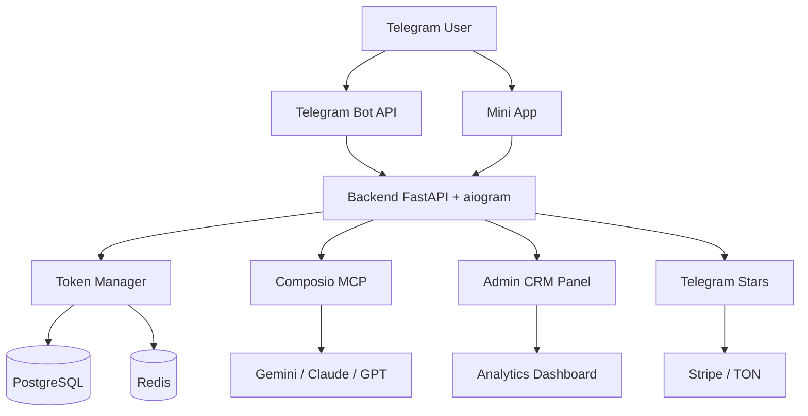
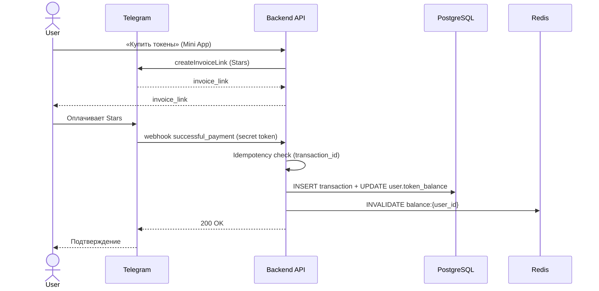
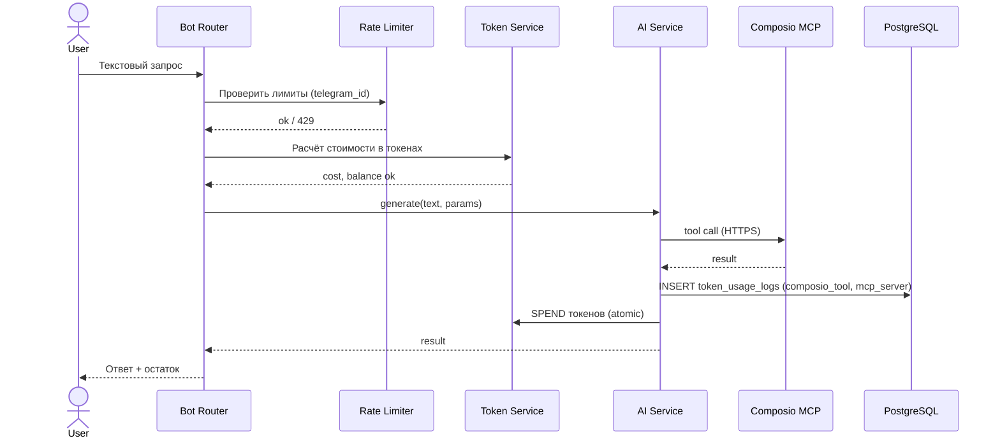

# Architecture Overview

Telegram AI Agent — конкурентный продукт на базе референса **Mira** с токеновой экономикой, ценообразованием на 50% дешевле аналогов и профессиональной CRM-системой.

Документация структурирована по нотации [C4 Model](https://c4model.com/). Все значимые архитектурные решения зафиксированы в [Architecture Decision Records](./architecture/adr/README.md).

## Карта документации

| Тип | Документ | Назначение |
|-----|----------|------------|
| Обзор | этот файл | Общая картина, ссылки на детали |
| C4-1 Context   | [`architecture/diagrams/c4-context.md`](./architecture/diagrams/c4-context.md) | Система в окружении пользователей и внешних сервисов |
| C4-2 Container | [`architecture/diagrams/c4-container.md`](./architecture/diagrams/c4-container.md) | Логические контейнеры (FastAPI, Redis, Postgres, Mini App, CRM) |
| C4-3 Component | [`architecture/diagrams/c4-component.md`](./architecture/diagrams/c4-component.md) | Внутреннее устройство backend |
| Deployment | [`architecture/diagrams/deployment.md`](./architecture/diagrams/deployment.md) | Развертывание в Kubernetes |
| ADR | [`architecture/adr/README.md`](./architecture/adr/README.md) | Реестр архитектурных решений |
| Безопасность | [`SECURITY.md`](./SECURITY.md) | Аутентификация, RBAC, шифрование |
| База данных | [`DATABASE_SCHEMA.md`](./DATABASE_SCHEMA.md) | Таблицы, индексы, инварианты |
| API | [`API_REFERENCE.md`](./API_REFERENCE.md) | REST-эндпоинты |

## High-level Diagram



Детальный разбор — на трёх уровнях C4: [Context](./architecture/diagrams/c4-context.md), [Container](./architecture/diagrams/c4-container.md), [Component](./architecture/diagrams/c4-component.md).

## Components

| Component | Stack | Purpose | Ссылка на ADR |
|-----------|-------|---------|---------------|
| Backend API + Bot | FastAPI + aiogram 3 (Python 3.11+) | Telegram webhook, REST API, бизнес-логика | [ADR-0001](./architecture/adr/0001-fastapi-vs-aiogram-only.md) |
| Database | PostgreSQL 15+ | Пользователи, транзакции, аналитика | [ADR-0005](./architecture/adr/0005-database-migrations.md) |
| Cache / Queue | Redis 7+ | Сессии, rate limit, celery broker | [ADR-0004](./architecture/adr/0004-rate-limiting.md) |
| Task Queue | Celery | Платёжные обработки, рассылки, фоновые задачи | — |
| Mini App | React + Telegram WebApp SDK | UI для пользователей внутри Telegram | [ADR-0003](./architecture/adr/0003-authentication-scheme.md) |
| Admin CRM | Next.js 14 + TypeScript | Управление проектом для администраторов | [ADR-0003](./architecture/adr/0003-authentication-scheme.md) |
| AI Provider | Composio MCP → Gemini / Claude / GPT | Генерация контента и текстовые запросы | [ADR-0002](./architecture/adr/0002-composio-mcp-vs-direct-sdk.md) |
| Payments | Telegram Stars (+ optional TON / Stripe) | Приём оплат | — |
| Monitoring | Prometheus + Grafana + Sentry | Метрики, дашборды, алерты | — |
| Deployment | Docker, Docker Compose, Kubernetes | Окружения и продакшн | [deployment.md](./architecture/diagrams/deployment.md) |

## Repository Layout

```
.
├── backend/             # FastAPI + aiogram приложение
│   ├── app/
│   │   ├── api/         # FastAPI routers (REST /api/v1)
│   │   ├── bot/         # aiogram routers и middlewares
│   │   ├── crm/         # Admin endpoints
│   │   ├── models/      # SQLAlchemy модели
│   │   ├── repositories/# Доступ к БД
│   │   ├── services/    # Бизнес-логика (tokens, ai, payments)
│   │   └── core/        # Конфиг, безопасность, DI
│   ├── alembic/         # Миграции БД (см. ADR-0005)
│   └── tests/
├── mini-app/            # React Mini App
├── admin-dashboard/     # Next.js админка
├── docs/
│   └── architecture/
│       ├── adr/         # Architecture Decision Records
│       └── diagrams/    # C4 диаграммы + deployment
├── docker/              # Dockerfile и compose
├── .github/             # CI/CD, шаблоны
└── scripts/             # Утилиты (seed, бэкап и т.д.)
```

## Архитектурные решения (ADR)

| № | Решение | Кратко | Статус |
|---|---------|--------|--------|
| [0001](./architecture/adr/0001-fastapi-vs-aiogram-only.md) | FastAPI + aiogram в одном процессе | DX FastAPI + общая бизнес-логика с ботом | Accepted |
| [0002](./architecture/adr/0002-composio-mcp-vs-direct-sdk.md) | Composio MCP как единый шлюз к LLM | Один adapter вместо 5–7 SDK | Accepted |
| [0003](./architecture/adr/0003-authentication-scheme.md) | Telegram initData (Mini App) + JWT (CRM) + webhook secret (бот) | Каждая зона — нативная схема | Accepted |
| [0004](./architecture/adr/0004-rate-limiting.md) | Redis sliding window log + slowapi | Точные лимиты, единый механизм | Accepted |
| [0005](./architecture/adr/0005-database-migrations.md) | Alembic + expand/contract | Zero-downtime миграции | Accepted |

Полный реестр и шаблон нового ADR — [architecture/adr/README.md](./architecture/adr/README.md).

## Data Flow: Покупка токенов



См. подробности: [ADR-0003](./architecture/adr/0003-authentication-scheme.md) (валидация webhook), [SECURITY.md](./SECURITY.md) (idempotency и аудит).

## Data Flow: Запрос к AI



См. [ADR-0002](./architecture/adr/0002-composio-mcp-vs-direct-sdk.md) и [ADR-0004](./architecture/adr/0004-rate-limiting.md).

## Security (резюме)

- **Telegram webhook** — secret token + проверка `update_id`.
- **Mini App** — HMAC-валидация Telegram `initData` ([ADR-0003](./architecture/adr/0003-authentication-scheme.md)).
- **Admin CRM** — JWT (15 мин) + refresh (HttpOnly cookie) + 2FA для `super_admin` + RBAC.
- **Rate limiting** — Redis sliding window log ([ADR-0004](./architecture/adr/0004-rate-limiting.md)).
- **Шифрование** — TLS 1.2+, чувствительные поля шифруются на уровне приложения для холодных бэкапов.
- **Аудит** — полный лог админских действий.

Подробности и checklist — [SECURITY.md](./SECURITY.md).

## Scalability

- Горизонтальное масштабирование backend через stateless API (2+ реплики, HPA по RPS).
- Celery worker'ы на отдельных подах, HPA по длине очереди.
- Redis HA (master + replica), отдельный namespace.
- PostgreSQL: read-replica для аналитики CRM, партиционирование `token_usage_logs` по дате ([DATABASE_SCHEMA.md](./DATABASE_SCHEMA.md)).
- Миграции без downtime ([ADR-0005](./architecture/adr/0005-database-migrations.md)).

## Observability

- **Метрики**: Prometheus scrape `/metrics` от backend (FastAPI + aiogram middleware) и Celery.
- **Дашборды**: Grafana — RPS, latency p50/p95/p99, ошибки 4xx/5xx, длина очереди Celery, balance операций.
- **Ошибки**: Sentry для backend и Mini App.
- **Алерты**: 5xx > 1%, p95 > 1с, длина очереди > 1000, неудачные логины > 10/час.

## Внешние документы

- [Telegram Bot API](https://core.telegram.org/bots/api)
- [Telegram WebApps](https://core.telegram.org/bots/webapps)
- [Composio MCP](https://docs.composio.dev/mcp)
- [C4 Model](https://c4model.com/)
- [adr-tools](https://github.com/npryce/adr-tools)
