# C4: Component Diagram — Backend API + Bot

Внутреннее устройство контейнера `Backend API + Bot` (FastAPI + aiogram).

```mermaid
C4Component
    title Component Diagram — Backend API + Bot

    Container_Ext(mini_app, "Mini App", "React")
    Container_Ext(admin_ui, "Admin CRM", "Next.js")
    Container_Ext(telegram, "Telegram", "Bot API / Stars")
    Container_Ext(composio, "Composio MCP")
    ContainerDb_Ext(postgres, "PostgreSQL")
    ContainerDb_Ext(redis, "Redis")

    Container_Boundary(api, "Backend API + Bot") {
        Component(http_router, "HTTP Router", "FastAPI APIRouter", "Маршрутизация REST /api/v1 для user, payment, admin, generate")
        Component(bot_router, "Bot Router", "aiogram Dispatcher", "Обработка update'ов: команды, сообщения, callback, payments")

        Component(auth_user, "Telegram Auth", "Dependency", "Валидация initData HMAC, выдача User")
        Component(auth_admin, "Admin JWT Auth", "Dependency", "JWT verify, RBAC проверка ролей")
        Component(rate_limiter, "Rate Limiter", "slowapi + Redis", "Sliding-window лимиты по telegram_id и IP")

        Component(token_svc, "Token Service", "Service", "Списание / начисление токенов, idempotency, расчёт стоимости")
        Component(payment_svc, "Payment Service", "Service", "Создание инвойса, обработка successful_payment, refund")
        Component(ai_svc, "AI Service", "Service", "Маршрутизация запросов к Composio MCP, выбор провайдера")
        Component(user_svc, "User Service", "Service", "Профиль, реферальная программа, бан/анбан")
        Component(admin_svc, "Admin Service", "Service", "Аналитика, ценообразование, рассылки")

        Component(repo, "Repositories", "SQLAlchemy 2.0 async", "users, transactions, token_usage_logs, settings")
        Component(cache, "Cache Layer", "redis-py", "Hot data: balance, settings, rate-limit окна")
        Component(queue, "Task Queue Client", "Celery client", "Постановка фоновых задач")
        Component(audit, "Audit Logger", "Service", "Логи админских действий, RBAC, безопасность")
    }

    Rel(mini_app, http_router, "REST /api/v1", "HTTPS + initData")
    Rel(admin_ui, http_router, "REST /api/v1/admin", "HTTPS + JWT")
    Rel(telegram, bot_router, "Webhook updates", "HTTPS")

    Rel(http_router, auth_user, "Зависимость для user-эндпоинтов")
    Rel(http_router, auth_admin, "Зависимость для admin-эндпоинтов")
    Rel(http_router, rate_limiter, "Middleware")
    Rel(bot_router, rate_limiter, "Middleware")

    Rel(http_router, token_svc, "Списание / баланс")
    Rel(http_router, payment_svc, "Создание инвойса, статус")
    Rel(http_router, ai_svc, "Генерация контента")
    Rel(http_router, user_svc, "Профиль, реферальная программа")
    Rel(http_router, admin_svc, "CRM действия")

    Rel(bot_router, token_svc, "Команды /balance, /buy")
    Rel(bot_router, payment_svc, "successful_payment")
    Rel(bot_router, ai_svc, "Текстовые запросы")
    Rel(bot_router, user_svc, "/start, реферальная привязка")

    Rel(token_svc, repo, "CRUD")
    Rel(payment_svc, repo, "Транзакции")
    Rel(ai_svc, repo, "token_usage_logs")
    Rel(user_svc, repo, "users")
    Rel(admin_svc, repo, "Все таблицы для отчётов")

    Rel(token_svc, cache, "Кэш баланса")
    Rel(rate_limiter, cache, "Sliding-window счётчики")

    Rel(payment_svc, queue, "Длительные начисления")
    Rel(admin_svc, queue, "Рассылки, агрегация")
    Rel(ai_svc, queue, "Async video / heavy tasks")

    Rel(admin_svc, audit, "Запись действий")
    Rel(auth_admin, audit, "Login/logout, неудачные попытки")

    Rel(repo, postgres, "SQL")
    Rel(cache, redis, "Redis protocol")
    Rel(queue, redis, "Broker")

    Rel(ai_svc, composio, "HTTPS")
    Rel(payment_svc, telegram, "createInvoiceLink", "HTTPS")
    Rel(bot_router, telegram, "sendMessage", "HTTPS")

    UpdateLayoutConfig($c4ShapeInRow="4", $c4BoundaryInRow="1")
```

## Слои

- **Routers** (`http_router`, `bot_router`) — тонкий слой, только валидация, вызов сервисов.
- **Auth/Middleware** — Telegram initData, Admin JWT, Rate Limiter.
- **Services** — бизнес-логика, без знания о транспортном уровне. Тестируются юнит-тестами с моками репозиториев.
- **Repositories** — SQLAlchemy async, единственный код, знающий о схеме БД.
- **Cache / Queue** — Redis в двух ролях.

## Принципы

1. Сервисы не зависят друг от друга напрямую — общение через события (`token_spent`, `payment_completed`) или через явные вызовы из router.
2. Каждая мутация баланса проходит через `Token Service` с idempotency key.
3. Аудит-лог обязателен для всех admin endpoints — см. [SECURITY.md](../../SECURITY.md).
4. Любой долгий запрос (>3 сек) уходит в Celery, клиенту возвращается `job_id`.
