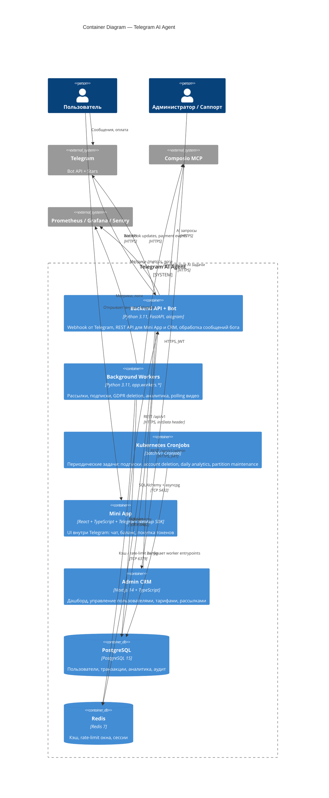

# C4: Container Diagram

Контейнеры внутри границы Telegram AI Agent. Контейнер ≈ деплоится отдельно (процесс, сервис, БД).

## Контейнеры

| Контейнер | Технология | Деплой | Ответственность |
|-----------|-----------|--------|-----------------|
| Backend API + Bot | FastAPI + aiogram 3 | k8s deployment, 2+ реплики | HTTP + bot webhook + бизнес-логика |
| Background Workers | Python 3.11, `app.workers.*` | k8s Deployments + CronJobs | Фоновые задачи (рассылки, подписки, аналитика, видео polling) |
| Mini App          | React 18 + Vite     | k8s + nginx, CDN | UI внутри Telegram |
| Admin CRM         | Next.js 14          | k8s + nginx | Веб-админка |
| PostgreSQL        | PostgreSQL 15       | Managed / StatefulSet | Основное хранилище |
| Redis             | Redis 7             | Managed / StatefulSet | Кэш + rate-limit |

## Почему такие границы

- **Backend API + Bot единый контейнер**: см. [ADR-001](../adr/0001-fastapi-vs-aiogram-only.md). FastAPI и aiogram живут вместе в одном процессе ради REST-эндпоинтов Mini App и CRM, переиспользования сервисного слоя и единого Observability.
- **Workers вынесены отдельно**: тяжёлые и периодические задачи не должны блокировать обработку webhook.
- **Mini App и CRM деплоятся как статика**: упрощает CDN-кеширование и независимый релиз UI.
- **Redis несёт две роли**: кэш и sliding-window rate-limit. Допустимо благодаря низкой нагрузке на каждую из них; при росте можно разнести инстансы.

> Глубже: [Component Diagram](./c4-component.md), [ADR-003](../adr/0003-authentication-scheme.md), [ADR-004](../adr/0004-rate-limiting.md).
