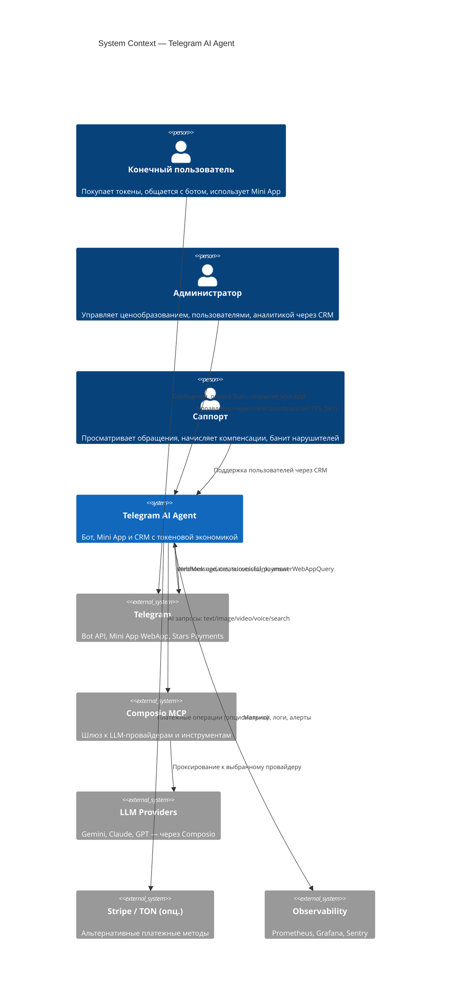

# C4: System Context

Telegram AI Agent в окружении пользователей и внешних систем.

## Ключевые акторы

| Актор | Канал | Что делает |
|-------|-------|------------|
| Пользователь | Telegram (бот + Mini App) | Покупает токены, отправляет AI запросы |
| Администратор | Admin CRM (web) | Настраивает тарифы, рассылки, видит аналитику |
| Саппорт | Admin CRM (web) | Поддерживает пользователей |

## Внешние зависимости

- **Telegram Bot API** — единственная точка входа для пользователя. Авторизация через `initData` HMAC.
- **Composio MCP** — единый интерфейс к LLM-провайдерам, см. [ADR-002](../adr/0002-composio-mcp-vs-direct-sdk.md).
- **Stripe / TON** — опциональные платежные методы (только если Telegram Stars не покрывает регион).
- **Prometheus / Grafana / Sentry** — мониторинг и алертинг.

> Уровень детализации ниже: [Container Diagram](./c4-container.md).
