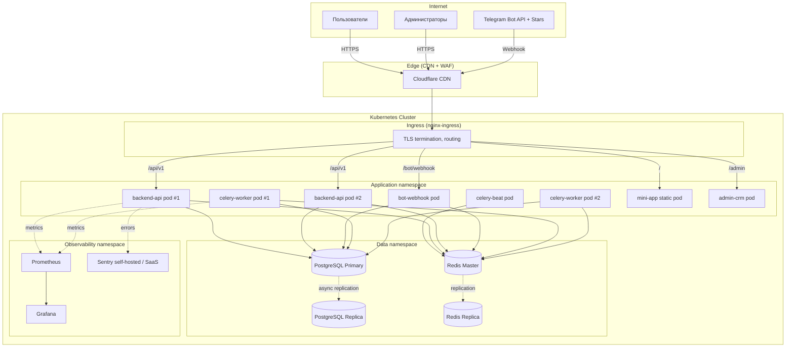

# Deployment Diagram

Развертывание Telegram AI Agent в production. Дополняет C4 Container Diagram физическим уровнем.

## Окружения

| Среда | Назначение | Ресурсы | Replicas API |
|-------|-----------|---------|--------------|
| `dev`     | Локально через docker-compose | 1× БД, 1× Redis | 1 |
| `staging` | E2E тесты, демонстрации        | Managed Postgres small, Redis small | 1 |
| `prod`    | Боевой                          | Managed Postgres HA, Redis HA | 2+ HPA |

## Blue/Green и миграции

Изменения схемы БД проходят строго через Alembic, без downtime — см. [ADR-005](../adr/0005-database-migrations.md).

## Секреты

- `bot_token`, `admin_jwt_secret`, `db_password`, `redis_password` — k8s `Secret` (sealed-secrets).
- В deve и staging — `.env` через docker-compose.

## Бэкапы

- PostgreSQL: ежедневный логический + WAL archive (PITR 7 дней).
- Redis: не критичен (кэш + очередь), но snapshot раз в час.

## Масштабирование

- `backend-api`: HPA по CPU + кастомной метрике `requests_per_second`.
- `celery-worker`: HPA по длине очереди в Redis (`celery_queue_length`).
- PostgreSQL: вертикально + read-replica для аналитики CRM.
