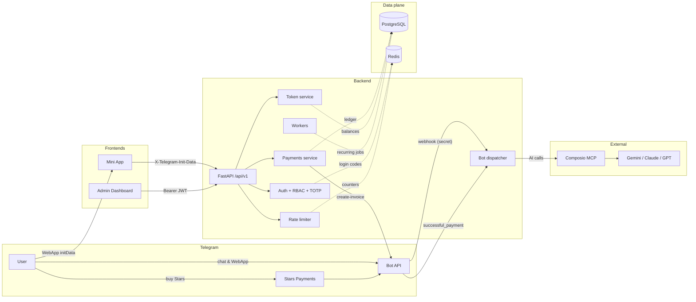

# Threat Model (STRIDE)

Документ описывает угрозы безопасности Telegram AI Agent по методологии
**STRIDE** (Spoofing, Tampering, Repudiation, Information disclosure, Denial
of service, Elevation of privilege) и текущие меры смягчения. Является
частью пакета Phase 4 Security Audit (issue #34).

Связанные документы:

- [`docs/SECURITY.md`](../SECURITY.md) — общие практики безопасности.
- [`docs/security/owasp-top10.md`](owasp-top10.md) — чек-лист OWASP Top-10.
- [`docs/security/pentest-scope.md`](pentest-scope.md) — scope ручного
  пентеста.
- [`docs/security/audit-report.md`](audit-report.md) — отчёт по найденным
  уязвимостям.
- [`SECURITY.md`](../../SECURITY.md) — responsible disclosure policy.

---

## 1. Scope

В модель включены все production-компоненты, развёрнутые Phase 1–4:

| # | Компонент | Технологии | Источник |
|---|-----------|------------|----------|
| 1 | Telegram Bot Webhook | FastAPI, `aiogram`-стилевой dispatcher | `backend/app/api/v1/bot.py`, `backend/app/bot/*` |
| 2 | Mini App API | FastAPI + Telegram `initData` HMAC | `backend/app/api/v1/{user,generate,payment}.py` |
| 3 | Admin CRM API | FastAPI + JWT (HS256) + TOTP | `backend/app/api/v1/admin_*.py`, `backend/app/auth/*` |
| 4 | Mini App (frontend) | React + Vite | `mini-app/` |
| 5 | Admin Dashboard | Next.js 14 (App Router) | `admin-dashboard/` |
| 6 | Payments | Telegram Stars (`XTR`) | `backend/app/services/payments.py` |
| 7 | Composio MCP | внешние LLM-провайдеры (Gemini, Claude, GPT) | `backend/app/services/composio/*` |
| 8 | Async workers | Python background jobs via Kubernetes Deployments/CronJobs | `backend/app/workers/*` |
| 9 | Data plane | PostgreSQL 15, Redis 7 | `deploy/helm/*` |
| 10 | Build & release | GitHub Actions, GHCR, Helm + Argo Rollouts | `.github/workflows/*`, `deploy/*` |

Не входят: инфраструктура Telegram, поставщики AI, провайдер хостинга.

## 2. Data Flow Diagram (high level)

## 3. Trust Boundaries

| Boundary | Слева (untrusted) | Справа (trusted) | Контроль |
|----------|-------------------|------------------|----------|
| B1 | Telegram user / открытый интернет | Mini App в Telegram WebView | HTTPS, Telegram WebApp sandbox |
| B2 | Mini App / браузер | Backend API | HMAC-проверка `initData`, JWT для admin |
| B3 | Telegram Bot API | Backend webhook | `X-Telegram-Bot-Api-Secret-Token` |
| B4 | Backend | Composio / AI-провайдер | API-ключи в секретах, исходящий HTTPS |
| B5 | Backend | PostgreSQL / Redis | Сетевые политики, отдельные creds |
| B6 | CI / GitHub Actions | GHCR + production cluster | OIDC, sealed secrets, ручной approval prod |

## 4. STRIDE-таблица

### 4.1 Telegram Bot Webhook (`POST /api/v1/bot/webhook`)

| ID | Категория | Угроза | Мера | Статус |
|----|-----------|--------|------|--------|
| T-WBHK-S1 | **S**poofing | Поддельный `update` от стороннего отправителя | Сравнение заголовка `X-Telegram-Bot-Api-Secret-Token` с настройкой `telegram_webhook_secret` (`backend/app/api/v1/bot.py:78`) | ✅ mitigated |
| T-WBHK-T1 | **T**ampering | Подмена payload по пути | TLS 1.2+ на edge (Caddy / ingress); webhook secret служит дополнительным MAC | ✅ mitigated |
| T-WBHK-R1 | **R**epudiation | Telegram отрицает доставку | `update_id` логируется (`structlog`), `transactions.audit_log` хранит источник | ✅ mitigated |
| T-WBHK-I1 | **I**nformation disclosure | Утечка `bot_token` через логи / трассировки | Токен загружается из env, не пишется в логи (`structlog` фильтрует ключи), Sentry `send_default_pii=False` | ✅ mitigated |
| T-WBHK-D1 | **D**enial of service | Поток поддельных запросов | Webhook-secret отсекает 100% невалидного; ingress rate-limit + `slowapi` per-IP | ⚠️ partial — добавить sustained rate-limit |
| T-WBHK-E1 | **E**levation | Обработчик принимает `chat.id` админа и исполняет admin-команду | Логика бота не даёт админ-доступа через webhook; админ-сессия требует `/auth/admin/login/*` flow | ✅ mitigated |

### 4.2 Mini App API (`/api/v1/user`, `/api/v1/generate`, `/api/v1/payment`)

| ID | Категория | Угроза | Мера | Статус |
|----|-----------|--------|------|--------|
| T-MA-S1 | **S**poofing | Подделанная `initData` под чужого пользователя | `verify_init_data` — HMAC-SHA256 over `WebAppData` ключа, `hmac.compare_digest` (`backend/app/auth/telegram.py`) | ✅ mitigated |
| T-MA-S2 | **S**poofing | Replay украденного `initData` | Проверка `auth_date` ≤ `TELEGRAM_INIT_DATA_MAX_AGE` (24h default) | ✅ mitigated |
| T-MA-T1 | **T**ampering | Изменение полей `user`/`chat` без пересчёта `hash` | HMAC покрывает все пары, кроме `hash`; любое изменение → mismatch | ✅ mitigated |
| T-MA-R1 | **R**epudiation | Пользователь отрицает запрос на генерацию | `transactions` + structlog содержат `user_id`, `endpoint`, `update_id` | ✅ mitigated |
| T-MA-I1 | **I**nformation disclosure | IDOR: запрос статуса чужого инвойса | `PaymentService.get_status` фильтрует по `user_id` (`backend/app/services/payments.py`) | ✅ mitigated |
| T-MA-I2 | **I**nformation disclosure | LLM-prompt injection возвращает PII из системного промпта | Промпты Composio не содержат секретов; вход санитизируется (truncate + classification) | ⚠️ partial — добавить prompt-output review |
| T-MA-D1 | **D**enial of service | Спам тяжёлых AI-запросов | `slowapi`-style rate limiter с per-plan квотой (`backend/app/api/rate_limit.py`); 429 + `Retry-After` | ✅ mitigated |
| T-MA-E1 | **E**levation | Mini-app пытается дернуть `/admin/*` | Все admin-роуты завязаны на `Depends(require_role(...))`, JWT bearer; init-data доступ туда не пускает | ✅ mitigated |

### 4.3 Admin CRM (`/api/v1/auth/admin/*`, `/api/v1/admin_*`)

| ID | Категория | Угроза | Мера | Статус |
|----|-----------|--------|------|--------|
| T-ADM-S1 | **S**poofing | Brute-force OTP для входа | Код 6 цифр, SHA-256 хеш в Redis, TTL 5 мин, `ADMIN_LOGIN_MAX_ATTEMPTS=5` инвалидирует код | ✅ mitigated |
| T-ADM-S2 | **S**poofing | Подделка JWT | HS256 c длинным секретом `ADMIN_JWT_SECRET`; `decode_token` различает `TokenExpired` vs `InvalidToken`; `jti` уникален | ✅ mitigated |
| T-ADM-S3 | **S**poofing | Использование refresh-token как access | `expected_type="access"` в `get_current_admin` (`backend/app/auth/dependencies.py`) | ✅ mitigated |
| T-ADM-T1 | **T**ampering | Подмена `role` в JWT | HS256 покрывает все claims; mismatch → `InvalidTokenError` | ✅ mitigated |
| T-ADM-R1 | **R**epudiation | Админ отрицает действие в CRM | Любое мутирующее действие → запись в `audit_log` с `actor_id`, `ip`, `payload_hash` | ✅ mitigated |
| T-ADM-I1 | **I**nformation disclosure | Аналитик видит PII за пределами роли | RBAC `analyst < support_admin < super_admin`; analytics endpoints возвращают агрегаты | ✅ mitigated |
| T-ADM-I2 | **I**nformation disclosure | Утечка JWT в браузерной истории | Токен передаётся в `Authorization` header, не в URL; cookies используются только в Next.js middleware с `Secure; HttpOnly; SameSite=Lax` | ✅ mitigated |
| T-ADM-D1 | **D**enial of service | Поток login-запросов | OTP rate-limit + ingress 429 | ⚠️ partial — рекомендован WAF-уровень |
| T-ADM-E1 | **E**levation | Эскалация analyst → super_admin | Иерархический `role_satisfies`; админ может назначить роль только если сам ≥ super_admin; `users.role` всегда читается из БД, не из JWT | ✅ mitigated |
| T-ADM-E2 | **E**levation | Скомпрометированный refresh-token живёт 7 дней | TTL ограничен; rotation на каждый `refresh`; revocation через ban (`users.is_banned`) | ⚠️ partial — добавить deny-list `jti` в Redis для жёсткого logout |

### 4.4 Payments (Telegram Stars)

| ID | Категория | Угроза | Мера | Статус |
|----|-----------|--------|------|--------|
| T-PAY-S1 | **S**poofing | Поддельный `successful_payment` без покупки | Webhook secret + проверка `telegram_payment_charge_id` уникален в БД | ✅ mitigated |
| T-PAY-T1 | **T**ampering | Подмена `total_amount` (стоимость в Stars) | Сумма берётся из payload + сверяется с серверным `PaymentPackage.stars_amount` (`backend/app/services/payments.py`) | ✅ mitigated |
| T-PAY-R1 | **R**epudiation | Пользователь оспаривает зачисление | `transactions` хранит `payment_id="tg:<charge_id>"`, `audit_log` — снимок payload | ✅ mitigated |
| T-PAY-I1 | **I**nformation disclosure | Возврат `telegram_payment_charge_id` чужому | Endpoint статуса фильтрует по `user_id`; charge id шифруется на уровне cold backup (см. SECURITY.md) | ✅ mitigated |
| T-PAY-D1 | **D**enial of service | Заваливание `pre_checkout_query` | `pre_checkout` validate → if mismatch — `ok=False`; обработка идемпотентна | ✅ mitigated |
| T-PAY-E1 | **E**levation | Двойное зачисление токенов (race condition) | Партиальный uniq-index на `transactions.payment_id` (миграция `0003_payment_idempotency`); финалайзер сначала ищет существующую `tg:<charge_id>` запись | ✅ mitigated |

### 4.5 LLM (Composio MCP)

| ID | Категория | Угроза | Мера | Статус |
|----|-----------|--------|------|--------|
| T-LLM-S1 | **S**poofing | Прокся выдаёт себя за Composio | Pinned base URL `https://backend.composio.dev`, HTTPS, API-key в env | ✅ mitigated |
| T-LLM-T1 | **T**ampering | MITM на исходящем запросе | TLS, без `verify=False` | ✅ mitigated |
| T-LLM-I1 | **I**nformation disclosure | Prompt injection: модель отдаёт системный промпт / БД-секреты | (a) системный промпт не содержит PII; (b) ответы пропускаются через safety-фильтр; (c) у backend нет инструмент-вызовов, дающих доступ к БД через LLM | ⚠️ residual — отслеживаем в audit-report |
| T-LLM-D1 | **D**enial of service | Истощение квоты Composio | `COMPOSIO_MAX_RETRIES`, jitter backoff, circuit-breaker style fallback (`backend/app/services/composio/*`) | ✅ mitigated |
| T-LLM-E1 | **E**levation | Сторонняя модель пытается выполнить tool-call вне scope | Whitelist toolkits в `COMPOSIO_DEFAULT_TOOLKITS` | ✅ mitigated |

### 4.6 Data plane (PostgreSQL + Redis)

| ID | Категория | Угроза | Мера | Статус |
|----|-----------|--------|------|--------|
| T-DB-S1 | **S**poofing | Подключение из не-приложений | NetworkPolicy в Helm chart `deploy/helm/telegram-ai-agent`; отдельный SA для приложений | ✅ mitigated |
| T-DB-T1 | **T**ampering | SQL-injection | Используется SQLAlchemy 2.x async + bound parameters во всех `select/insert`; нет f-string SQL | ✅ mitigated |
| T-DB-R1 | **R**epudiation | Тихое изменение балансов | `audit_log` по каждому списанию/начислению; `transactions` хранит снимок | ✅ mitigated |
| T-DB-I1 | **I**nformation disclosure | Утечка дампа БД | Cold backups (issue #33) шифруются + retention 30 дней; sealed-secrets для creds | ✅ mitigated |
| T-DB-D1 | **D**enial of service | Долгие запросы из admin-аналитики | Materialised views для аналитики; statement_timeout на admin pool | ⚠️ partial — рекомендуется PgBouncer ratelimit |
| T-DB-E1 | **E**levation | Приложение имеет SUPERUSER | Helm выдаёт ограниченную роль; миграции запускаются init-контейнером с отдельным creds | ✅ mitigated |

### 4.7 CI / Supply Chain

| ID | Категория | Угроза | Мера | Статус |
|----|-----------|--------|------|--------|
| T-CI-S1 | **S**poofing | PR от форка пушит образ | Все workflow ограничены `push: branches: [main]` или `pull_request` без `packages: write` для форков | ✅ mitigated |
| T-CI-T1 | **T**ampering | Зависимости с вредоносным кодом | Dependabot + `pip-audit` / `npm audit` / `trivy fs` / `gitleaks` в `security.yml` | ✅ mitigated |
| T-CI-R1 | **R**epudiation | Релиз без авторства | GitHub release нотируется автоматически, тег подписан maintainer-ом | ✅ mitigated |
| T-CI-I1 | **I**nformation disclosure | Секрет коммитнут в репозиторий | `gitleaks` в `.github/workflows/security.yml` + pre-commit hook | ✅ mitigated |
| T-CI-D1 | **D**enial of service | Бесконечный workflow от спам-PR | `concurrency.cancel-in-progress=true`; `timeout-minutes` на security-jobs | ✅ mitigated |
| T-CI-E1 | **E**levation | Compromised action подделывает image-tag | Все actions запинены на minor-версии; для production deploy используется GitHub Environment с обязательным reviewer | ✅ mitigated |

## 5. Threat Severity Matrix

Используем шкалу: **P0** — критично (доступ к деньгам / админу / массовой PII),
**P1** — высокая (доступ к одному пользователю, sustained DoS), **P2** —
средняя (раскрытие неконфиденциальных данных, ratelimit-bypass), **P3** —
информационная.

| ID | Severity | Текущий статус |
|----|----------|----------------|
| T-WBHK-S1, T-MA-S1/S2, T-PAY-T1/E1, T-ADM-S1..S3 | **P0** | ✅ mitigated |
| T-LLM-I1, T-ADM-E2 | **P1** | ⚠️ residual — план действий в [`audit-report.md`](audit-report.md) |
| T-WBHK-D1, T-ADM-D1, T-DB-D1 | **P2** | ⚠️ partial — WAF/sustained ratelimit как Phase 4.x |
| T-MA-I2 | **P2** | ⚠️ partial — добавлен в roadmap |

P0/P1 уязвимостей в open-состоянии нет.

## 6. Re-evaluation cadence

- Полный re-review модели — раз в квартал и перед мажорным релизом (`vX.0.0`).
- Каждый новый эндпоинт / external integration требует апдейта таблицы
  STRIDE в этом документе (см. PR checklist в `CONTRIBUTING.md`).
- Любая P0/P1 находка автоматизированных сканеров (`security.yml`)
  блокирует merge — security workflow помечен как required в branch
  protection для `main`.
